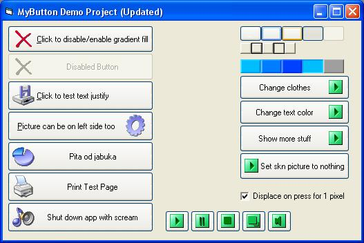



## MyButton

### Description

CooL Skinable Button (iButton) for any app. Just one UserControl in Exe Project and ready for use. (very, very good button , you MUST HAVE THIS - DON'T MISS). Enjoy!!!
 
### More Info
 

             |
---                |---
**Submitted On**   |2003-05-05 21:04:36
**By**             |[Edin Omeragic ](https://github.com/Planet-Source-Code/PSCIndex/blob/master/ByAuthor/edin-omeragic.md)
**Level**          |Advanced
**User Rating**    |4.7 (164 globes from 35 users)
**Compatibility**  |VB 5\.0, VB 6\.0
**Category**       |[Custom Controls/ Forms/  Menus](https://github.com/Planet-Source-Code/PSCIndex/blob/master/ByCategory/custom-controls-forms-menus__1-4.md)
**World**          |[Visual Basic](https://github.com/Planet-Source-Code/PSCIndex/blob/master/ByWorld/visual-basic.md)
**Archive File**   |[MyButton\_\-1601496162003\.zip](https://github.com/Planet-Source-Code/edin-omeragic-mybutton__1-41271/archive/master.zip)

